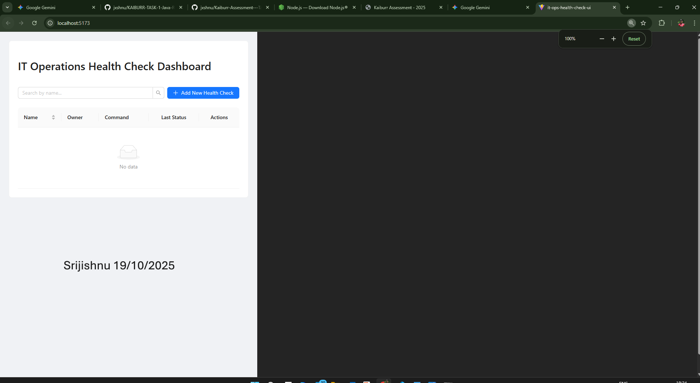
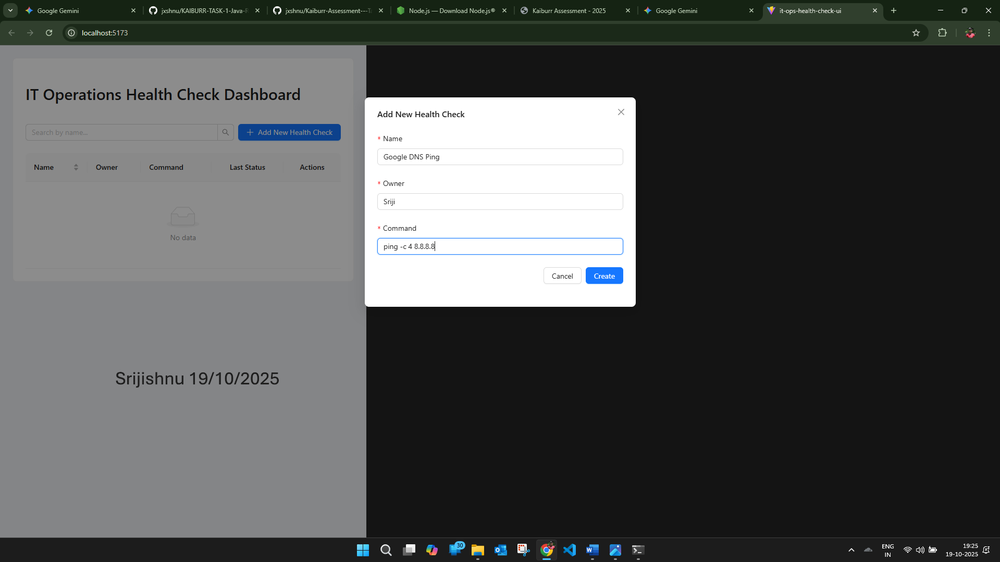
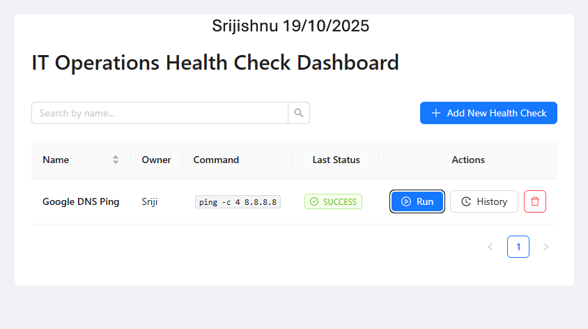
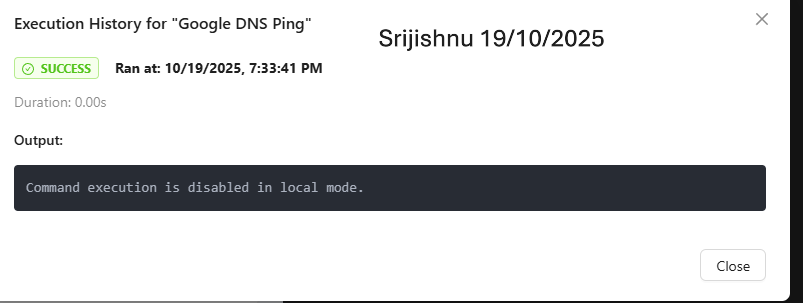

Kaiburr Assessment - Task 3: React Frontend UI

This repository contains the complete frontend solution for **Task 3 of the Kaiburr Technical Assessment**.  
It is a modern, responsive, and user-friendly web application built with **React 19**, **TypeScript**, and **Ant Design** to provide a comprehensive user interface for the IT Operations Health Check API created in **Task 1**.

The application allows users to seamlessly manage and execute diagnostic tasks, view their history, and get real-time feedback, with a strong focus on usability and a clean user experience as requested by the assessment.


 Key Features & Technology Stack

 Technology Stack
- **React 19** – Latest React version for building dynamic, responsive UIs.
- **TypeScript** – Type-safe code for reliability and maintainability.
- **Vite** – Ultra-fast build tool for optimized frontend performance.
- **Ant Design** – Enterprise-grade UI component library for a polished interface.

 Core Functionality
- **Full CRUD Operations:** Create, view, search, and delete health check tasks.  
- **Dynamic Task Execution:** Each task includes a “Run” button that triggers backend execution, displaying loading and success/error states.  
- **Detailed History:** “View History” modal shows complete logs of all past executions, including timestamps and outputs.  
- **Instant Search:** Quickly filter tasks by name on the client side.  
- **User-Friendly Forms:** Includes validation and confirmation steps for safe data handling.


 1. Main Dashboard View
**Description:**  
The main dashboard displaying a table of all available health checks fetched from the live backend API.




 2. Creating a New Task
**Description:**  
The “Add New Health Check” modal showing form fields for creating a task.




 3. Running a Task & Receiving Feedback
**Description:**  
A task being executed — shows the “Run” button loading and the Ant Design success notification.



 4. Viewing Execution History
**Description:**  
The “Execution History” modal displaying a detailed log of previous runs, including command output.




 Local Setup and Running Instructions

 ⚙️ Prerequisites
- **Node.js (LTS)**
- **Running Backend API** (Task 1 Java Spring Boot app)


 Steps to Run

1. **Clone the repository**
   ```bash
   git clone <your-repo-url>
   cd it-ops-health-check-ui
   ```

2. **Install dependencies**
   ```bash
   npm install
   ```

3. **Configure the API URL**
   - Open `src/App.tsx`
   - Locate the `API_BASE_URL` constant
   - Set it to your backend endpoint, e.g.:
     ```typescript
     const API_BASE_URL = "http://localhost:8081/api";
     ```

4. **Start the development server**
   ```bash
   npm run dev
   ```

5. **Open the application**
   Navigate to **[http://localhost:5173](http://localhost:5173)** in your browser.


 **Tip:** For production deployment, use `npm run build` and host the generated `/dist` folder on any static web host.


 License
This project is created as part of the **Kaiburr Technical Assessment**.  
You may view, clone, and use it for review or educational purposes.
